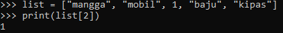
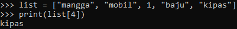
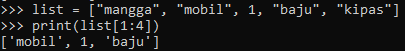
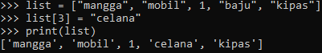
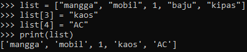
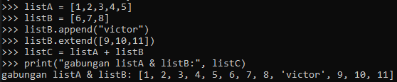

# PRAKTIKUM9
## TUGAS PERTEMUAN 9

 akses list

 • tampilkan elemen ke 3

 • ambil nilai elemen ke 2 sampai elemen ke 4

 • ambil elemen terakhir

 ubah elemen list:

 • ubah elemen ke 4 dengan nilai lainnya

 • ubah elemen ke 4 sampai dengan elemen terakhir

 tambah elemen list:

 • ambil 2 bagian dari list pertama (A) dan jadikan list ke 2 (B)

 • tambah list B dengan nilai string

 • tambah list B dengan 3 nilai

 • gabungkan list B dengan list A

